# DPMBG Guide — Element Inventory (Fase 1)

Auto-dumped via `tools/guide/explore.py` (login platform_admin, base state).

## Dashboard  `/`  (`dashboard`)

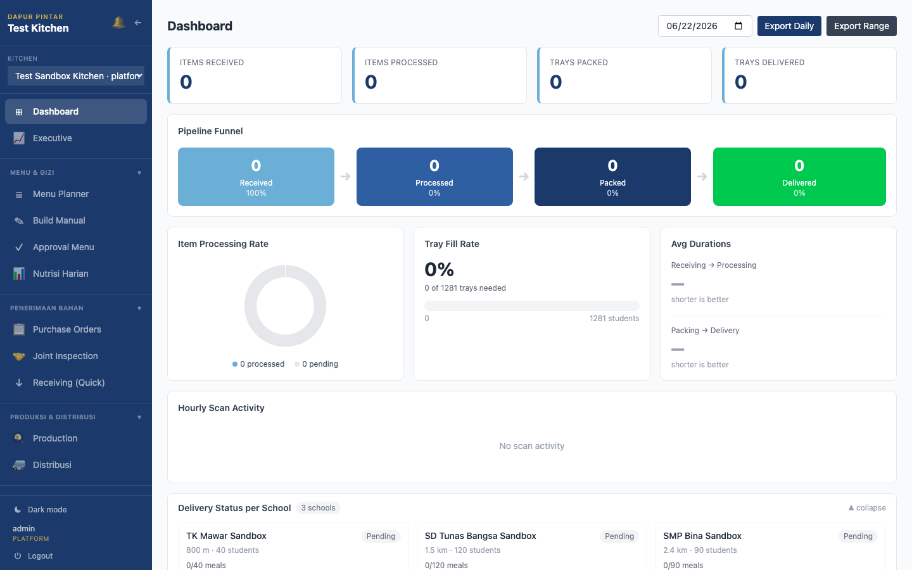

**Headings:** Dashboard · Pipeline Funnel · Item Processing Rate · Tray Fill Rate · Avg Durations · Hourly Scan Activity · Delivery Status per School · Delivery Completion Timeline · 7-Day Receiving Trend

**Buttons:** `🔔` · `←` · `MENU & GIZI ▼` · `PENERIMAAN BAHAN ▼` · `PRODUKSI & DISTRIBUSI ▼` · `LAPANGAN & MONITORING ▼` · `KEUANGAN ▼` · `MASTER DATA ▼` · `ADMIN DAPUR ▼` · `PLATFORM ▼` · `☾ Dark mode` · `⏻ Logout` · `Export Range` · `Delivery Status per School 3 schools ▲ collapse` · `Delivery Completion Timeline 3 schools ▲ collapse` · `Items` · `Trays`

**Inputs:** date `` __ · text `` _Search by name..._

**Select** ``: 🌐 All kitchens, Test Sandbox Kitchen · platform_admin

---

## Executive  `/executive`  (`executive`)

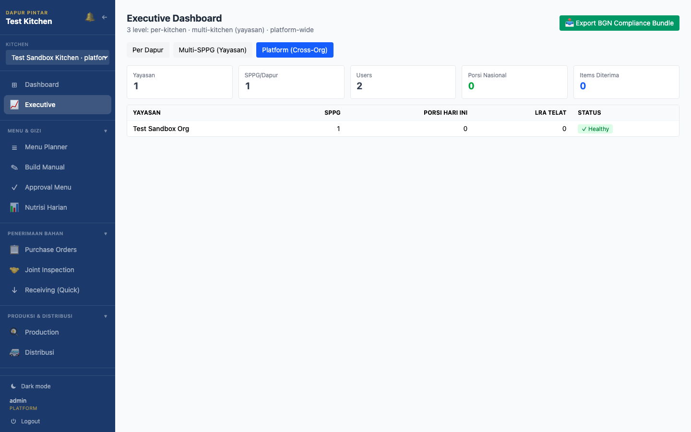

**Headings:** Executive Dashboard

**Buttons:** `🔔` · `←` · `MENU & GIZI ▼` · `PENERIMAAN BAHAN ▼` · `PRODUKSI & DISTRIBUSI ▼` · `LAPANGAN & MONITORING ▼` · `KEUANGAN ▼` · `MASTER DATA ▼` · `ADMIN DAPUR ▼` · `PLATFORM ▼` · `☾ Dark mode` · `⏻ Logout` · `📥 Export BGN Compliance Bundle` · `Per Dapur` · `Multi-SPPG (Yayasan)` · `Platform (Cross-Org)`

**Select** ``: 🌐 All kitchens, Test Sandbox Kitchen · platform_admin

---

## Menu Planner  `/menu-planner`  (`menu-planner`)

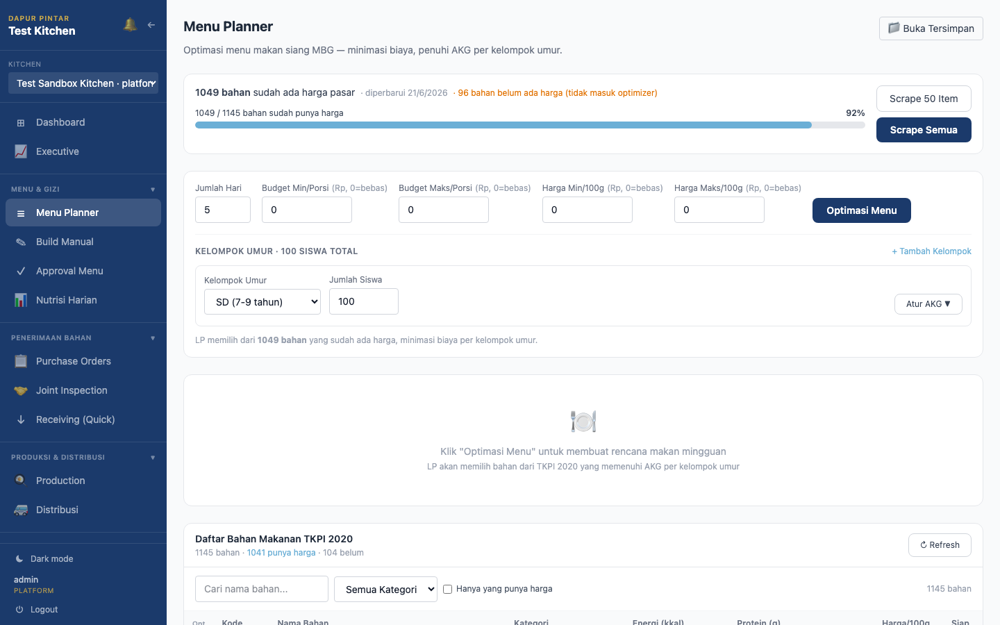

**Headings:** Menu Planner · Daftar Bahan Makanan TKPI 2020

**Buttons:** `🔔` · `←` · `MENU & GIZI ▼` · `PENERIMAAN BAHAN ▼` · `PRODUKSI & DISTRIBUSI ▼` · `LAPANGAN & MONITORING ▼` · `KEUANGAN ▼` · `MASTER DATA ▼` · `ADMIN DAPUR ▼` · `PLATFORM ▼` · `☾ Dark mode` · `⏻ Logout` · `📁 Buka Tersimpan` · `Scrape 50 Item` · `Scrape Semua` · `Optimasi Menu` · `+ Tambah Kelompok` · `Atur AKG ▼` · `↻ Refresh` · `✎` · `✎` · `hist` · `edit` · `✎` · `✎` · `hist` · `edit` · `✎` · `✎` · `hist` · `edit` · `✎` · `✎` · `hist` · `edit` · `✎` · `✎` · `hist` · `edit` · `✎` · `✎` · `hist` · `edit` · `✎` · `✎` · `hist` · `edit` · `✎` · `✎` · `hist` · `edit` · `✎` · `✎` · `hist` · `edit` · `✎` · `✎` · `hist` · `edit` · `✎` · `✎` · `hist` · `edit` · `✎` · `✎` · `hist` · `edit` · `✎` · `✎` · `hist` · `edit` · `✎` · `✎` · `hist` · `edit` · `✎` · `✎` · `hist` · `edit` · `✎` · `✎` · `hist` · `edit` · `✎` · `✎` · `hist` · `edit` · `✎` · `✎` · `hist` · `edit` · `✎` · `✎` · `hist` · `edit` · `✎` · `✎` · `hist` · `edit` · `✎` · `✎` · `hist` · `edit` · `✎` · `✎` · `hist` · `edit` · `✎` · `✎` · `hist` · `edit` · `✎` · `✎` · `hist` · `edit` · `✎` · `✎` · `hist` · `edit` · `✎` · `✎` · `hist` · `edit` · `✎` · `✎` · `hist` · `edit` · `✎` · `✎` · `hist` · `edit` · `✎` · `✎` · `hist` · `edit` · `✎` · `✎` · `hist` · `edit` · `✎` · `✎` · `hist` · `edit` · `✎` · `✎` · `hist` · `edit` · `✎` · `✎` · `hist` · `edit` · `✎` · `✎` · `hist` · `edit` · `✎` · `✎` · `hist` · `edit` · `✎` · `✎` · `hist` · `edit` · `✎` · `✎` · `hist` · `edit` · `✎` · `✎` · `hist` · `edit` · `✎` · `✎` · `hist` · `edit` · `✎` · `✎` · `hist` · `edit` · `✎` · `✎` · `hist` · `edit` · `✎` · `✎` · `hist` · `edit` · `✎` · `✎` · `hist` · `edit` · `✎` · `✎` · `hist` · `edit` · `✎` · `✎` · `hist` · `edit` · `✎` · `✎` · `hist` · `edit` · `✎` · `✎` · `hist` · `edit` · `✎` · `✎` · `hist` · `edit` · `✎` · `✎` · `hist` · `edit` · `✎` · `✎` · `hist` · `edit` · `«` · `‹` · `1` · `2` · `3` · `4` · `5` · `›` · `»`

**Inputs:** number `` __ · number `` __ · number `` __ · number `` __ · number `` __ · number `` __ · text `` _Cari nama bahan..._ · checkbox `` __ · checkbox `` __ · checkbox `` __ · checkbox `` __ · checkbox `` __ · checkbox `` __ · checkbox `` __ · checkbox `` __ · checkbox `` __ · checkbox `` __ · checkbox `` __ · checkbox `` __ · checkbox `` __ · checkbox `` __ · checkbox `` __ · checkbox `` __ · checkbox `` __ · checkbox `` __ · checkbox `` __ · checkbox `` __ · checkbox `` __ · checkbox `` __ · checkbox `` __ · checkbox `` __ · checkbox `` __ · checkbox `` __ · checkbox `` __ · checkbox `` __ · checkbox `` __ · checkbox `` __ · checkbox `` __ · checkbox `` __ · checkbox `` __ · checkbox `` __ · checkbox `` __ · checkbox `` __ · checkbox `` __ · checkbox `` __ · checkbox `` __ · checkbox `` __ · checkbox `` __ · checkbox `` __ · checkbox `` __ · checkbox `` __ · checkbox `` __ · checkbox `` __ · checkbox `` __ · checkbox `` __ · checkbox `` __ · checkbox `` __ · checkbox `` __

**Select** ``: 🌐 All kitchens, Test Sandbox Kitchen · platform_admin

**Select** ``: TK (4-6 tahun), SD (7-9 tahun), SD (10-12 tahun), SMP (13-15 tahun), SMA (16-18 tahun)

**Select** ``: Semua Kategori, Makanan Pokok, Lauk Hewani, Lauk Nabati, Sayuran, Buah, Lainnya

---

## Build Manual  `/menu-manual`  (`build-manual`)

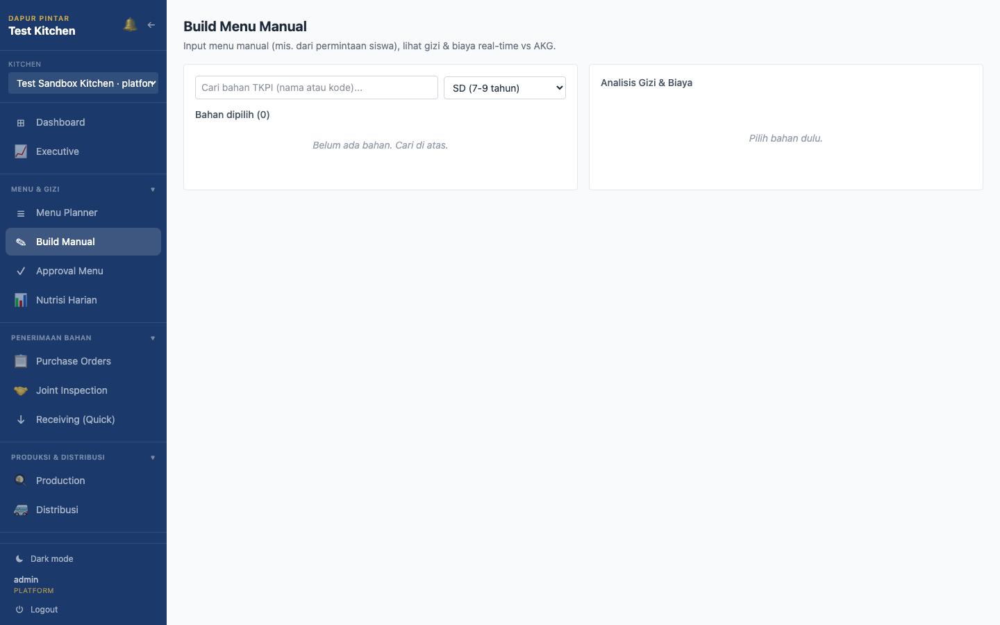

**Headings:** Build Menu Manual · Bahan dipilih (0) · Analisis Gizi & Biaya

**Buttons:** `🔔` · `←` · `MENU & GIZI ▼` · `PENERIMAAN BAHAN ▼` · `PRODUKSI & DISTRIBUSI ▼` · `LAPANGAN & MONITORING ▼` · `KEUANGAN ▼` · `MASTER DATA ▼` · `ADMIN DAPUR ▼` · `PLATFORM ▼` · `☾ Dark mode` · `⏻ Logout`

**Inputs:** text `` _Cari bahan TKPI (nama atau kode)..._

**Select** ``: 🌐 All kitchens, Test Sandbox Kitchen · platform_admin

**Select** ``: TK (4-6 tahun), SD (7-9 tahun), SD (10-12 tahun), SMP (13-15 tahun), SMA (16-18 tahun)

---

## Approval Menu  `/menu-approval`  (`menu-approval`)

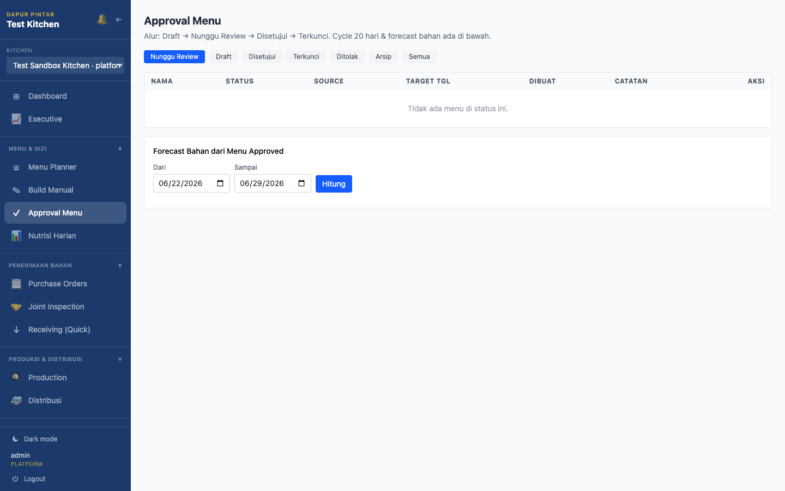

**Headings:** Approval Menu · Forecast Bahan dari Menu Approved

**Buttons:** `🔔` · `←` · `MENU & GIZI ▼` · `PENERIMAAN BAHAN ▼` · `PRODUKSI & DISTRIBUSI ▼` · `LAPANGAN & MONITORING ▼` · `KEUANGAN ▼` · `MASTER DATA ▼` · `ADMIN DAPUR ▼` · `PLATFORM ▼` · `☾ Dark mode` · `⏻ Logout` · `Nunggu Review` · `Draft` · `Disetujui` · `Terkunci` · `Ditolak` · `Arsip` · `Semua` · `Hitung`

**Inputs:** date `` __ · date `` __

**Select** ``: 🌐 All kitchens, Test Sandbox Kitchen · platform_admin

---

## Nutrisi Harian  `/nutrisi`  (`nutrisi`)

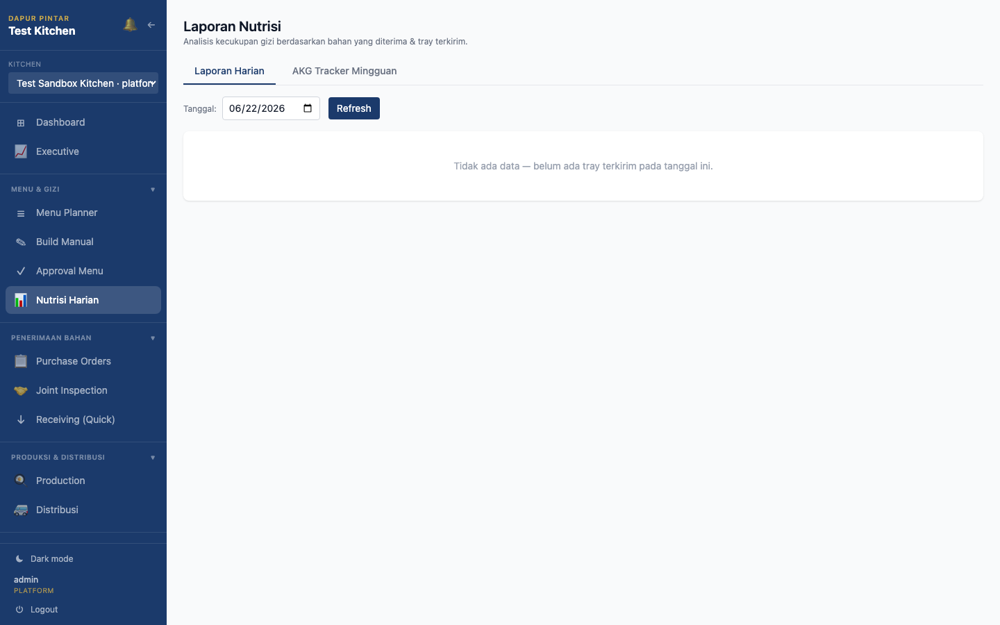

**Headings:** Laporan Nutrisi

**Buttons:** `🔔` · `←` · `MENU & GIZI ▼` · `PENERIMAAN BAHAN ▼` · `PRODUKSI & DISTRIBUSI ▼` · `LAPANGAN & MONITORING ▼` · `KEUANGAN ▼` · `MASTER DATA ▼` · `ADMIN DAPUR ▼` · `PLATFORM ▼` · `☾ Dark mode` · `⏻ Logout` · `Laporan Harian` · `AKG Tracker Mingguan` · `Refresh`

**Inputs:** date `` __

**Select** ``: 🌐 All kitchens, Test Sandbox Kitchen · platform_admin

---

## Purchase Orders  `/purchase-orders`  (`purchase-orders`)

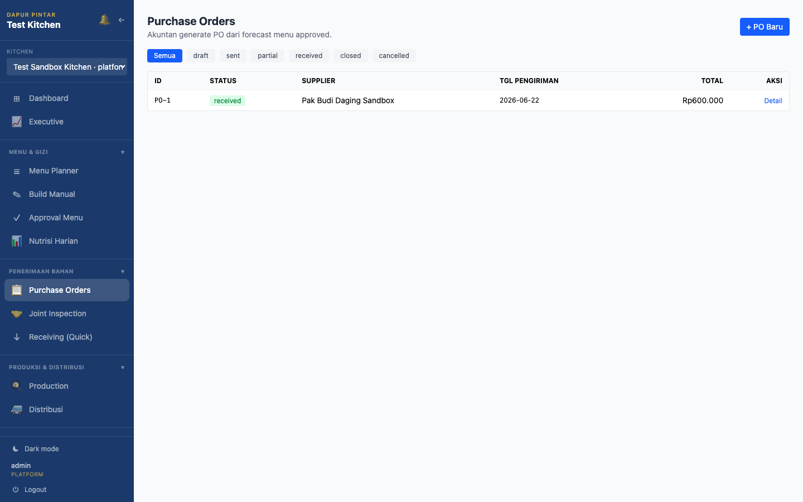

**Headings:** Purchase Orders

**Buttons:** `🔔` · `←` · `MENU & GIZI ▼` · `PENERIMAAN BAHAN ▼` · `PRODUKSI & DISTRIBUSI ▼` · `LAPANGAN & MONITORING ▼` · `KEUANGAN ▼` · `MASTER DATA ▼` · `ADMIN DAPUR ▼` · `PLATFORM ▼` · `☾ Dark mode` · `⏻ Logout` · `+ PO Baru` · `Semua` · `draft` · `sent` · `partial` · `received` · `closed` · `cancelled` · `Detail`

**Select** ``: 🌐 All kitchens, Test Sandbox Kitchen · platform_admin

---

## Joint Inspection  `/inspections`  (`inspections`)

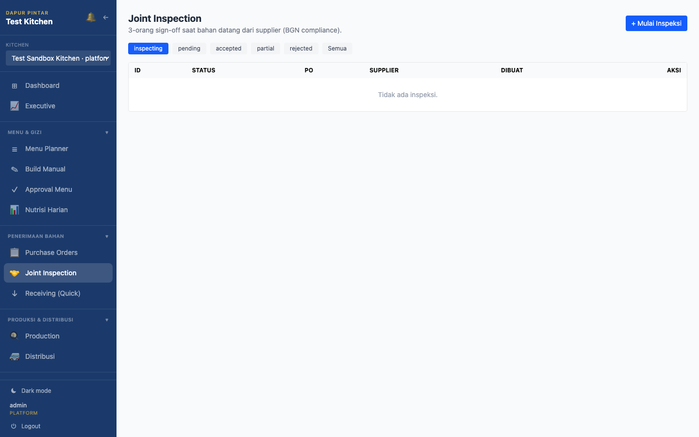

**Headings:** Joint Inspection

**Buttons:** `🔔` · `←` · `MENU & GIZI ▼` · `PENERIMAAN BAHAN ▼` · `PRODUKSI & DISTRIBUSI ▼` · `LAPANGAN & MONITORING ▼` · `KEUANGAN ▼` · `MASTER DATA ▼` · `ADMIN DAPUR ▼` · `PLATFORM ▼` · `☾ Dark mode` · `⏻ Logout` · `+ Mulai Inspeksi` · `inspecting` · `pending` · `accepted` · `partial` · `rejected` · `Semua`

**Select** ``: 🌐 All kitchens, Test Sandbox Kitchen · platform_admin

---

## Receiving (Quick)  `/receiving`  (`receiving`)

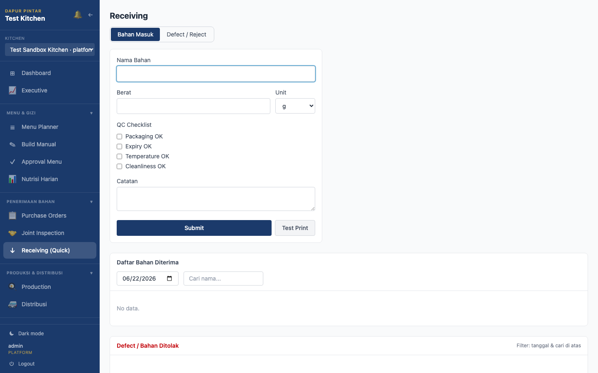

**Headings:** Receiving · Daftar Bahan Diterima · Defect / Bahan Ditolak

**Buttons:** `🔔` · `←` · `MENU & GIZI ▼` · `PENERIMAAN BAHAN ▼` · `PRODUKSI & DISTRIBUSI ▼` · `LAPANGAN & MONITORING ▼` · `KEUANGAN ▼` · `MASTER DATA ▼` · `ADMIN DAPUR ▼` · `PLATFORM ▼` · `☾ Dark mode` · `⏻ Logout` · `Bahan Masuk` · `Defect / Reject` · `Submit` · `Test Print`

**Inputs:** text `` __ · number `` __ · checkbox `` __ · checkbox `` __ · checkbox `` __ · checkbox `` __ · textarea `` __ · date `` __ · text `` _Cari nama..._

**Select** ``: 🌐 All kitchens, Test Sandbox Kitchen · platform_admin

**Select** ``: g, kg, pcs

---

## Production  `/production`  (`production`)

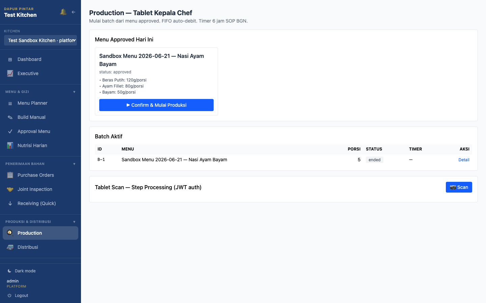

**Headings:** Production — Tablet Kepala Chef · Menu Approved Hari Ini · Batch Aktif · Tablet Scan — Step Processing (JWT auth)

**Buttons:** `🔔` · `←` · `MENU & GIZI ▼` · `PENERIMAAN BAHAN ▼` · `PRODUKSI & DISTRIBUSI ▼` · `LAPANGAN & MONITORING ▼` · `KEUANGAN ▼` · `MASTER DATA ▼` · `ADMIN DAPUR ▼` · `PLATFORM ▼` · `☾ Dark mode` · `⏻ Logout` · `▶ Confirm & Mulai Produksi` · `Detail` · `📷 Scan`

**Select** ``: 🌐 All kitchens, Test Sandbox Kitchen · platform_admin

---

## Distribusi  `/distributions`  (`distributions`)

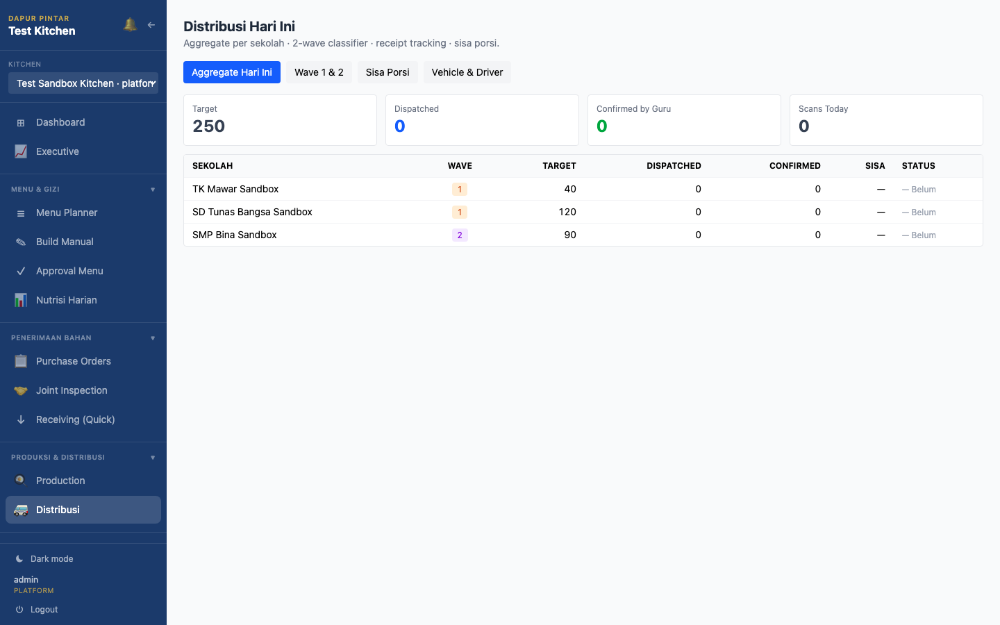

**Headings:** Distribusi Hari Ini

**Buttons:** `🔔` · `←` · `MENU & GIZI ▼` · `PENERIMAAN BAHAN ▼` · `PRODUKSI & DISTRIBUSI ▼` · `LAPANGAN & MONITORING ▼` · `KEUANGAN ▼` · `MASTER DATA ▼` · `ADMIN DAPUR ▼` · `PLATFORM ▼` · `☾ Dark mode` · `⏻ Logout` · `Aggregate Hari Ini` · `Wave 1 & 2` · `Sisa Porsi` · `Vehicle & Driver`

**Select** ``: 🌐 All kitchens, Test Sandbox Kitchen · platform_admin

---

## ASLAP Daily  `/aslap`  (`aslap`)

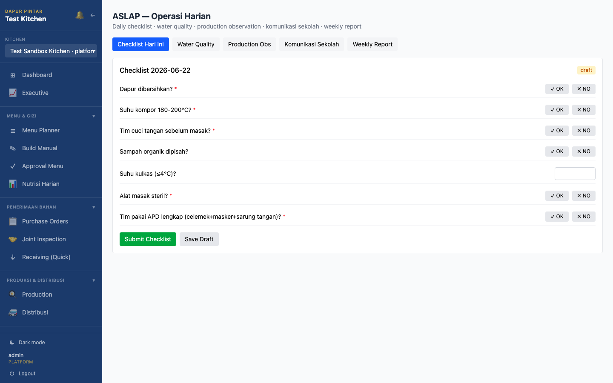

**Headings:** ASLAP — Operasi Harian · Checklist 2026-06-22

**Buttons:** `🔔` · `←` · `MENU & GIZI ▼` · `PENERIMAAN BAHAN ▼` · `PRODUKSI & DISTRIBUSI ▼` · `LAPANGAN & MONITORING ▼` · `KEUANGAN ▼` · `MASTER DATA ▼` · `ADMIN DAPUR ▼` · `PLATFORM ▼` · `☾ Dark mode` · `⏻ Logout` · `Checklist Hari Ini` · `Water Quality` · `Production Obs` · `Komunikasi Sekolah` · `Weekly Report` · `✓ OK` · `✗ NO` · `✓ OK` · `✗ NO` · `✓ OK` · `✗ NO` · `✓ OK` · `✗ NO` · `✓ OK` · `✗ NO` · `✓ OK` · `✗ NO` · `Submit Checklist` · `Save Draft`

**Inputs:** number `` __

**Select** ``: 🌐 All kitchens, Test Sandbox Kitchen · platform_admin

---

## Scan Errors  `/scan-errors`  (`scan-errors`)

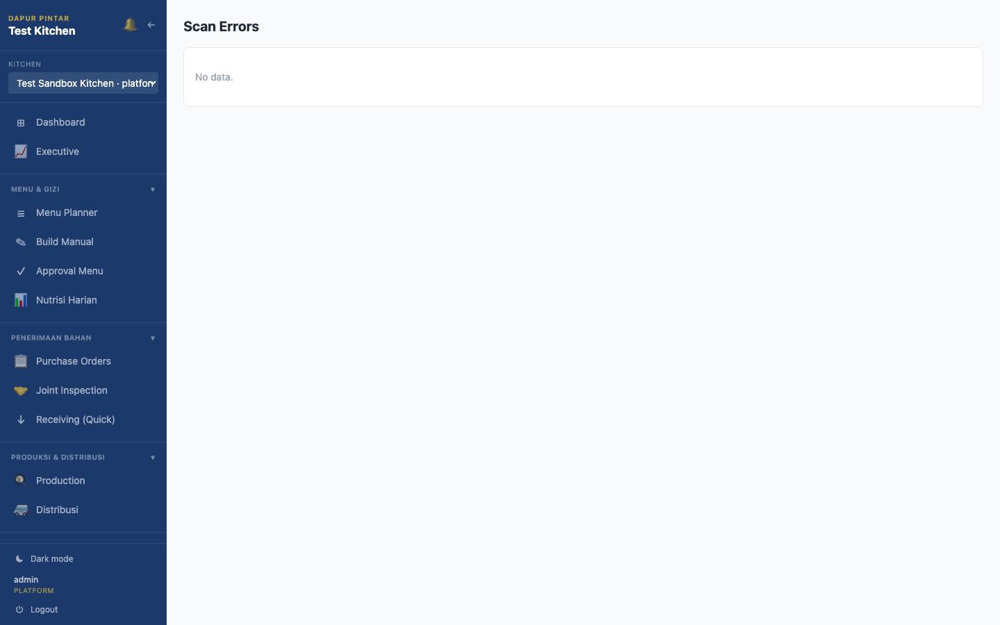

**Headings:** Scan Errors

**Buttons:** `🔔` · `←` · `MENU & GIZI ▼` · `PENERIMAAN BAHAN ▼` · `PRODUKSI & DISTRIBUSI ▼` · `LAPANGAN & MONITORING ▼` · `KEUANGAN ▼` · `MASTER DATA ▼` · `ADMIN DAPUR ▼` · `PLATFORM ▼` · `☾ Dark mode` · `⏻ Logout`

**Select** ``: 🌐 All kitchens, Test Sandbox Kitchen · platform_admin

---

## Variance Report  `/reports/variance`  (`variance`)

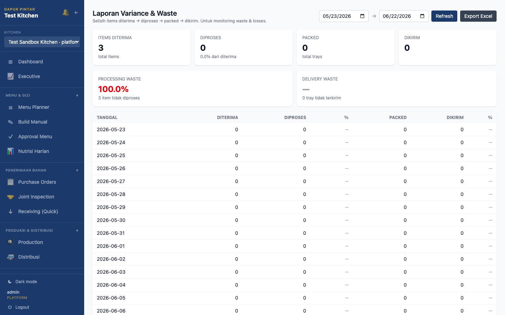

**Headings:** Laporan Variance & Waste

**Buttons:** `🔔` · `←` · `MENU & GIZI ▼` · `PENERIMAAN BAHAN ▼` · `PRODUKSI & DISTRIBUSI ▼` · `LAPANGAN & MONITORING ▼` · `KEUANGAN ▼` · `MASTER DATA ▼` · `ADMIN DAPUR ▼` · `PLATFORM ▼` · `☾ Dark mode` · `⏻ Logout` · `Refresh`

**Inputs:** date `` __ · date `` __

**Select** ``: 🌐 All kitchens, Test Sandbox Kitchen · platform_admin

---

## Akuntan Finance  `/finance`  (`finance`)

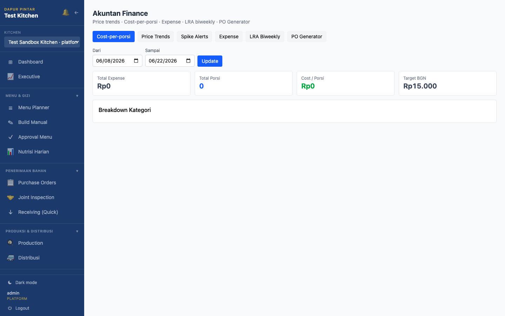

**Headings:** Akuntan Finance · Breakdown Kategori

**Buttons:** `🔔` · `←` · `MENU & GIZI ▼` · `PENERIMAAN BAHAN ▼` · `PRODUKSI & DISTRIBUSI ▼` · `LAPANGAN & MONITORING ▼` · `KEUANGAN ▼` · `MASTER DATA ▼` · `ADMIN DAPUR ▼` · `PLATFORM ▼` · `☾ Dark mode` · `⏻ Logout` · `Cost-per-porsi` · `Price Trends` · `Spike Alerts` · `Expense` · `LRA Biweekly` · `PO Generator` · `Update`

**Inputs:** date `` __ · date `` __

**Select** ``: 🌐 All kitchens, Test Sandbox Kitchen · platform_admin

---

## Master Sekolah  `/admin/schools`  (`admin-schools`)

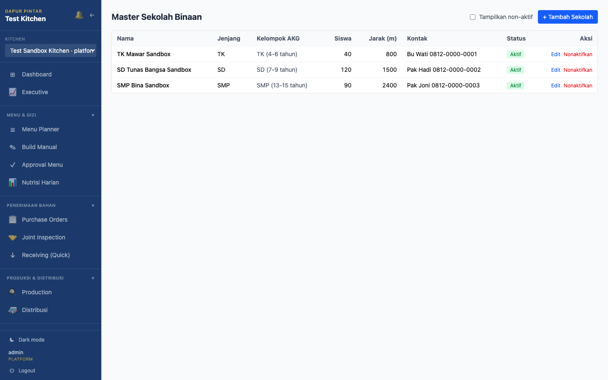

**Headings:** Master Sekolah Binaan

**Buttons:** `🔔` · `←` · `MENU & GIZI ▼` · `PENERIMAAN BAHAN ▼` · `PRODUKSI & DISTRIBUSI ▼` · `LAPANGAN & MONITORING ▼` · `KEUANGAN ▼` · `MASTER DATA ▼` · `ADMIN DAPUR ▼` · `PLATFORM ▼` · `☾ Dark mode` · `⏻ Logout` · `+ Tambah Sekolah` · `Edit` · `Nonaktifkan` · `Edit` · `Nonaktifkan` · `Edit` · `Nonaktifkan`

**Inputs:** checkbox `` __

**Select** ``: 🌐 All kitchens, Test Sandbox Kitchen · platform_admin

---

## Master Supplier  `/admin/suppliers`  (`admin-suppliers`)

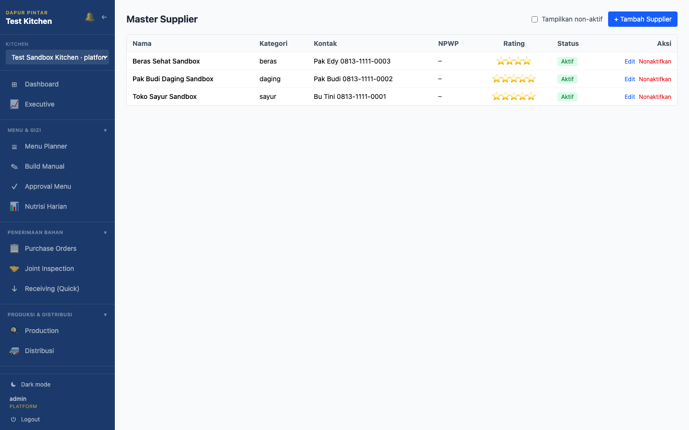

**Headings:** Master Supplier

**Buttons:** `🔔` · `←` · `MENU & GIZI ▼` · `PENERIMAAN BAHAN ▼` · `PRODUKSI & DISTRIBUSI ▼` · `LAPANGAN & MONITORING ▼` · `KEUANGAN ▼` · `MASTER DATA ▼` · `ADMIN DAPUR ▼` · `PLATFORM ▼` · `☾ Dark mode` · `⏻ Logout` · `+ Tambah Supplier` · `Edit` · `Nonaktifkan` · `Edit` · `Nonaktifkan` · `Edit` · `Nonaktifkan`

**Inputs:** checkbox `` __

**Select** ``: 🌐 All kitchens, Test Sandbox Kitchen · platform_admin

---

## Users  `/admin/users`  (`admin-users`)

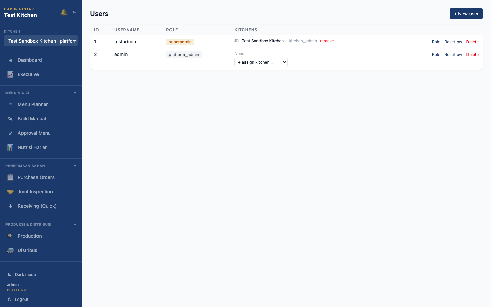

**Headings:** Users

**Buttons:** `🔔` · `←` · `MENU & GIZI ▼` · `PENERIMAAN BAHAN ▼` · `PRODUKSI & DISTRIBUSI ▼` · `LAPANGAN & MONITORING ▼` · `KEUANGAN ▼` · `MASTER DATA ▼` · `ADMIN DAPUR ▼` · `PLATFORM ▼` · `☾ Dark mode` · `⏻ Logout` · `+ New user` · `remove` · `Role` · `Reset pw` · `Delete` · `Role` · `Reset pw` · `Delete`

**Select** ``: 🌐 All kitchens, Test Sandbox Kitchen · platform_admin

**Select** ``: + assign kitchen…, Test Sandbox Kitchen

---

## Kitchens  `/admin/kitchens`  (`admin-kitchens`)

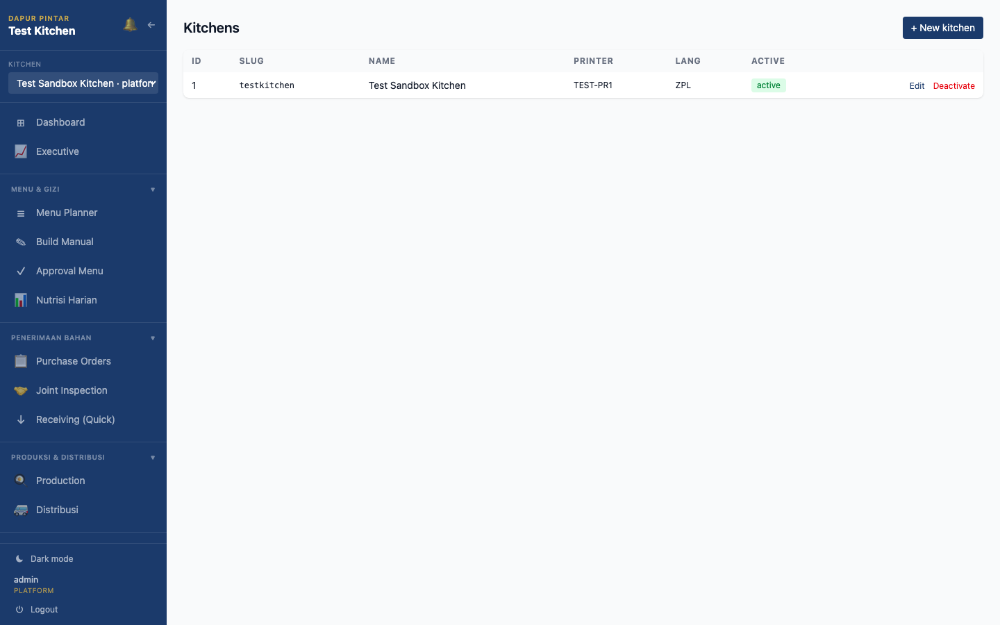

**Headings:** Kitchens

**Buttons:** `🔔` · `←` · `MENU & GIZI ▼` · `PENERIMAAN BAHAN ▼` · `PRODUKSI & DISTRIBUSI ▼` · `LAPANGAN & MONITORING ▼` · `KEUANGAN ▼` · `MASTER DATA ▼` · `ADMIN DAPUR ▼` · `PLATFORM ▼` · `☾ Dark mode` · `⏻ Logout` · `+ New kitchen` · `Edit` · `Deactivate`

**Select** ``: 🌐 All kitchens, Test Sandbox Kitchen · platform_admin

---

## All Kitchens  `/admin/overview`  (`admin-overview`)

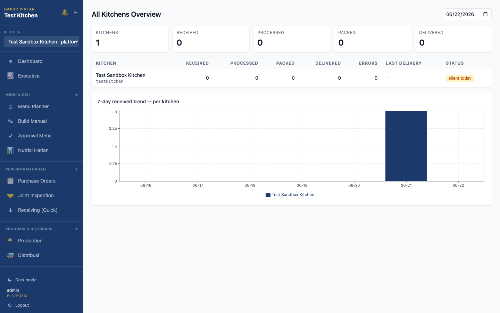

**Headings:** All Kitchens Overview · 7-day received trend — per kitchen

**Buttons:** `🔔` · `←` · `MENU & GIZI ▼` · `PENERIMAAN BAHAN ▼` · `PRODUKSI & DISTRIBUSI ▼` · `LAPANGAN & MONITORING ▼` · `KEUANGAN ▼` · `MASTER DATA ▼` · `ADMIN DAPUR ▼` · `PLATFORM ▼` · `☾ Dark mode` · `⏻ Logout`

**Inputs:** date `` __

**Select** ``: 🌐 All kitchens, Test Sandbox Kitchen · platform_admin

---

## Organizations  `/admin/organizations`  (`admin-orgs`)

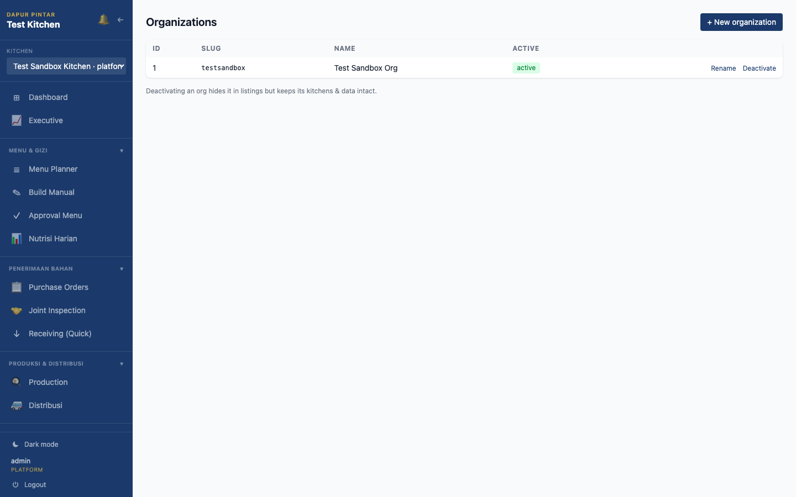

**Headings:** Organizations

**Buttons:** `🔔` · `←` · `MENU & GIZI ▼` · `PENERIMAAN BAHAN ▼` · `PRODUKSI & DISTRIBUSI ▼` · `LAPANGAN & MONITORING ▼` · `KEUANGAN ▼` · `MASTER DATA ▼` · `ADMIN DAPUR ▼` · `PLATFORM ▼` · `☾ Dark mode` · `⏻ Logout` · `+ New organization` · `Rename` · `Deactivate`

**Select** ``: 🌐 All kitchens, Test Sandbox Kitchen · platform_admin

---

