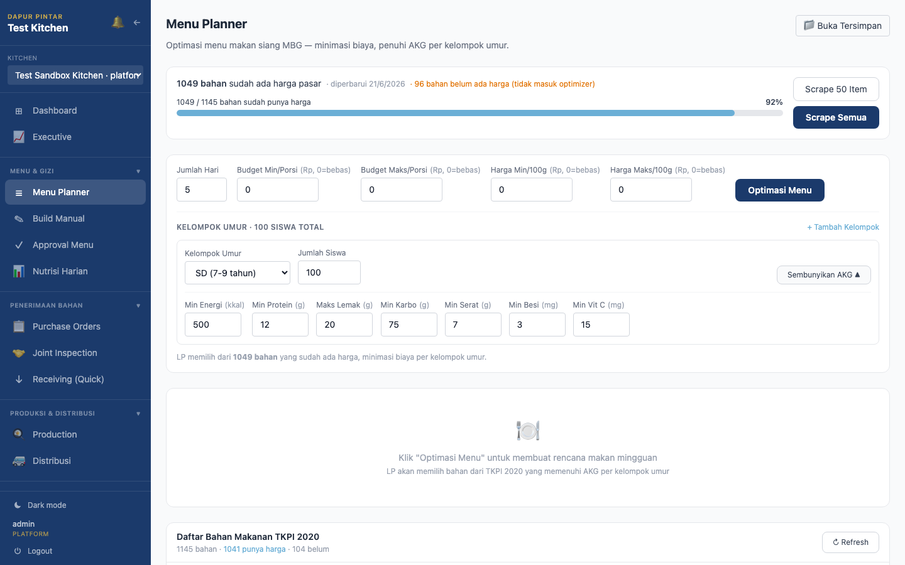
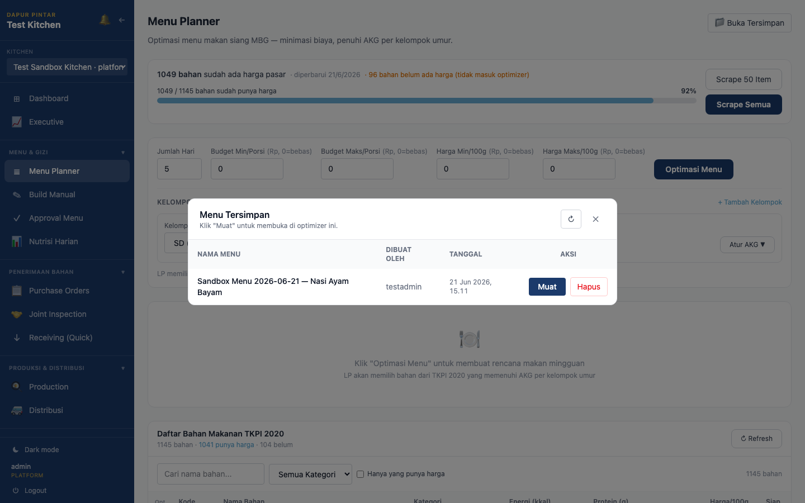
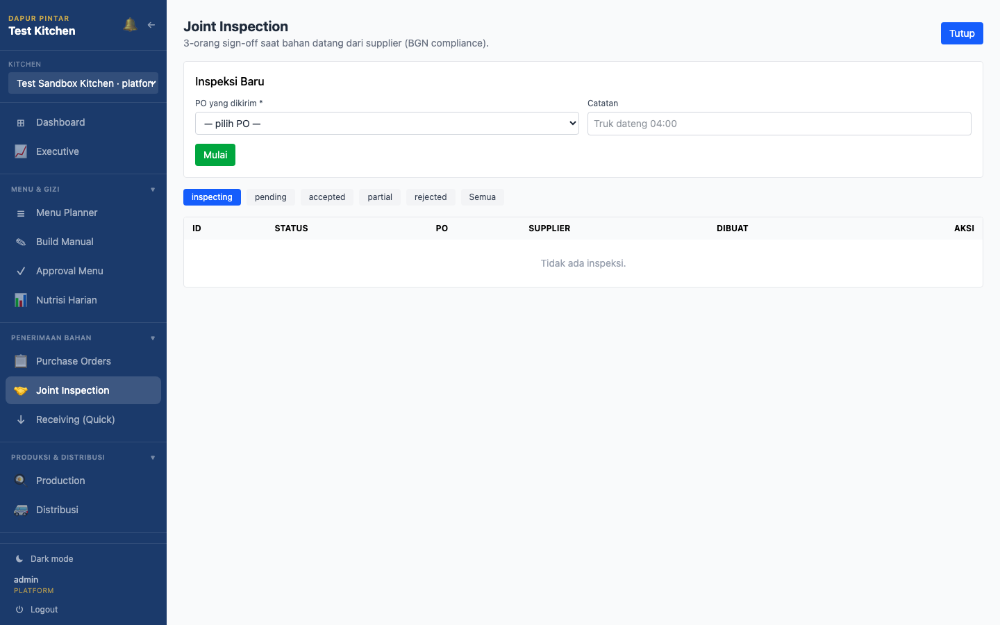
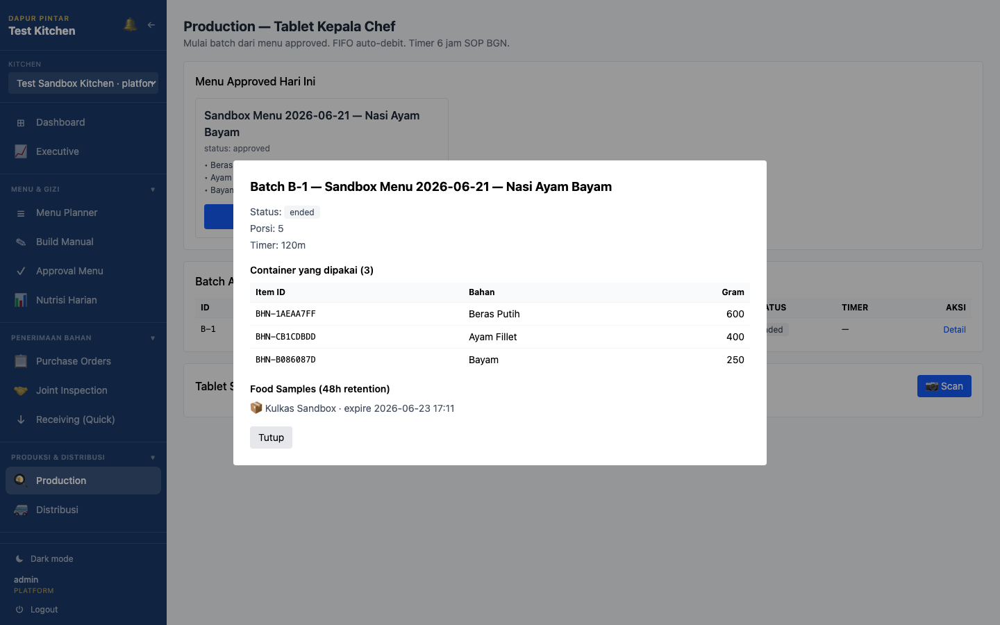
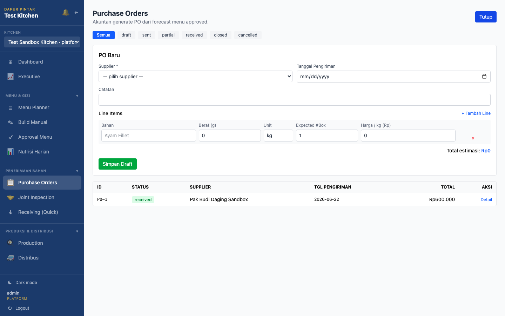
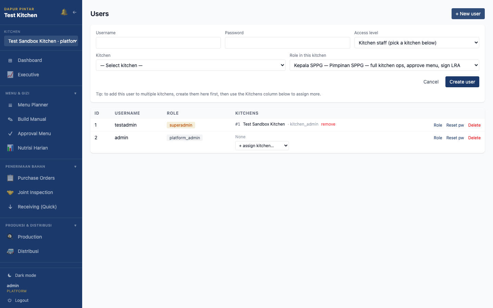
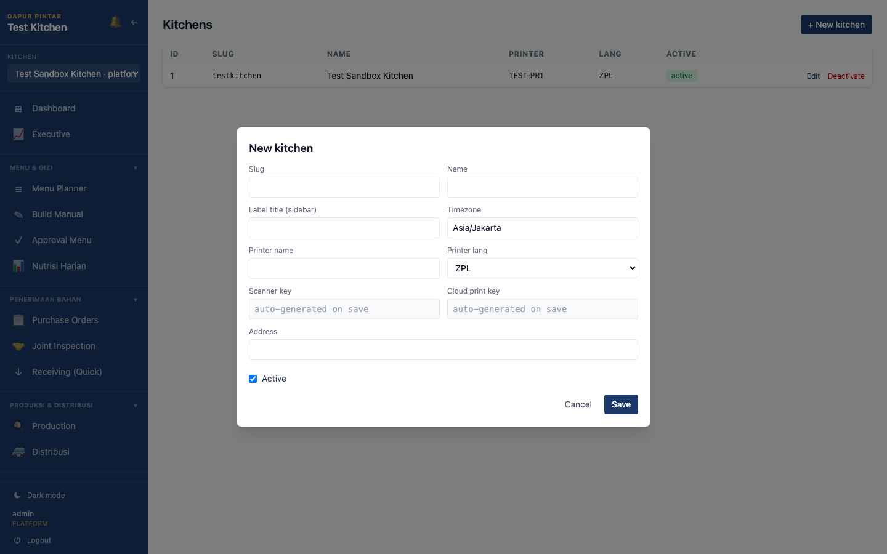
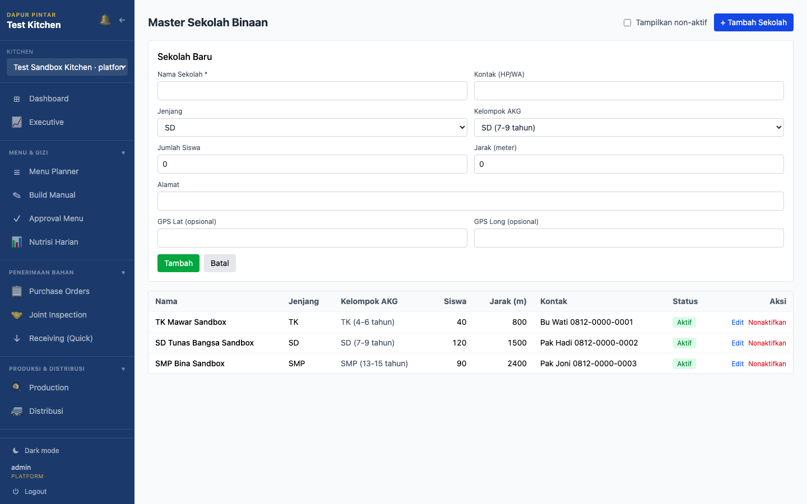
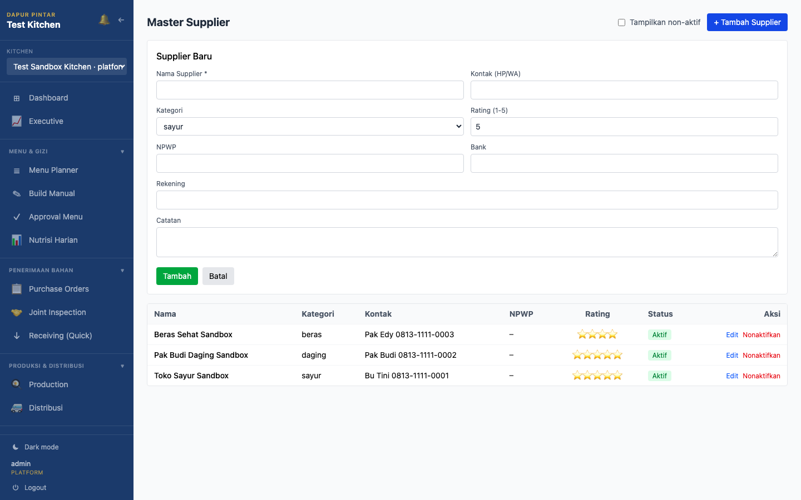
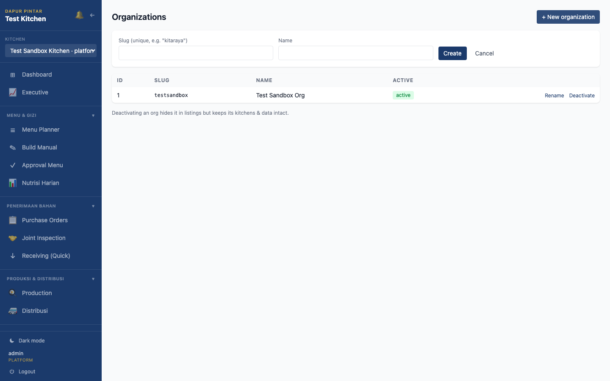

# DPMBG — Panduan Pengguna (User Guide)

Panduan cara pakai **Dapur Pintar MBG** per fitur, dikelompokkan per role.
Fitur yang dipakai banyak role ditulis lengkap **satu kali** di role pemiliknya,
lalu di-_cross-ref_ (lihat ➡️) dari role lain.

> Screenshot di panduan ini diambil dari aplikasi yang berjalan (login `platform_admin`,
> data sandbox). Tampilan dapur/data Anda bisa berbeda isinya, tapi tombol & alurnya sama.

## Daftar Isi

- [0. Umum — berlaku semua role](#0-umum--berlaku-semua-role)
- [1. Ahli Gizi (nutritionist)](#1-ahli-gizi-nutritionist)
- [2. Kepala Dapur (head_kitchen)](#2-kepala-dapur-head_kitchen)
- [3. ASLAP (asisten lapangan)](#3-aslap-asisten-lapangan)
- [4. Akuntan (accountant)](#4-akuntan-accountant)
- [5. Kepala SPPG (head_sppg)](#5-kepala-sppg-head_sppg)
- [6. Superadmin (admin organisasi)](#6-superadmin-admin-organisasi)
- [7. Platform Admin](#7-platform-admin)

### Hierarki role (siapa lihat apa)

```
platform_admin → superadmin (org) → head_sppg → (ahli_gizi / akuntan / aslap / kepala_dapur) per dapur
```

Role di atas mewarisi akses role di bawahnya (kecuali fitur yang dikunci khusus).
Akses tiap fitur diatur oleh **Role Access Matrix** di backend — kalau menu tidak
muncul di sidebar Anda, berarti role Anda memang tidak diberi izin ke situ.

---

## 0. Umum — berlaku semua role

### 0.1 Login

**Tujuan:** masuk ke aplikasi. **Siapa:** semua role.

1. Buka URL aplikasi → halaman **Login**.
2. Isi **Username** dan **Password** (akun dibuat oleh Superadmin lewat fitur [Users](#62-users)).
3. Klik **Login**.

Setelah login, aplikasi membuka **Dashboard** sesuai role Anda. Sidebar kiri hanya
menampilkan grup menu yang boleh Anda akses.

### 0.2 Navigasi & elemen yang selalu ada

Di setiap halaman, sidebar kiri & header punya elemen tetap:

| Elemen | Fungsi |
|---|---|
| **Kitchen switcher** (dropdown atas sidebar) | Pindah dapur aktif. Pilih `🌐 All kitchens` untuk lihat lintas dapur (hanya role tertentu). |
| Grup menu (`MENU & GIZI ▼`, `PENERIMAAN BAHAN ▼`, `PRODUKSI & DISTRIBUSI ▼`, `LAPANGAN & MONITORING ▼`, `KEUANGAN ▼`, `MASTER DATA ▼`, `ADMIN DAPUR ▼`, `PLATFORM ▼`) | Klik header grup untuk lipat/buka. Isi grup = fitur yang boleh Anda akses. |
| `🔔` (lonceng) | Notifikasi. |
| `←` | Lipat/lebarkan sidebar. |
| `☾ Dark mode` | Ganti tema terang/gelap. |
| `⏻ Logout` | Keluar. |

> **Catatan dapur aktif:** hampir semua data (menu, PO, produksi, dll) terikat ke
> **dapur yang sedang dipilih** di kitchen switcher. Salah pilih dapur = data salah.
> Pastikan nama dapur di atas sidebar benar sebelum input.

### 0.3 Dashboard

**Tujuan:** ringkasan harian operasi dapur. **Siapa:** semua role.

**Cara buka:** menu **Dashboard** (paling atas), atau otomatis terbuka setelah login.


**Isi & cara baca:**
- **4 kartu KPI** di atas — angka inti hari ini (bahan diterima, porsi, dll).
- **Pipeline Funnel** — alur bahan: diterima → produksi → distribusi.
- **Item Processing Rate / Tray Fill Rate** — kecepatan proses & isi tray (mis. `0 of 1281 students`).
- **Avg Durations / Hourly Scan Activity** — durasi rata-rata & aktivitas scan per jam.
- **Delivery Status per School** & **Delivery Completion Timeline** — status kirim per sekolah; klik judul kartu untuk **collapse/expand**.
- **7-Day Receiving Trend** — tren penerimaan 7 hari.

**Field & tombol penting:**
- **Tanggal** (input date) — ganti tanggal yang ditampilkan.
- **Search by name…** — cari sekolah di kartu delivery.
- **Export Range** — ekspor data rentang tanggal.
- Toggle **Items / Trays** — ganti satuan grafik.

**Tips:** kalau semua angka 0, cek tanggal & dapur aktif dulu sebelum panik.

---

## 1. Ahli Gizi (nutritionist)

Pemilik rantai perencanaan menu: rencana → susun → ajukan → laporan gizi.
Fitur: Dashboard ➡️ [0.3](#03-dashboard), Menu Planner, Build Manual, Approval Menu,
Nutrisi Harian, Joint Inspection (sign-off **Kualitas**) ➡️ [2.4](#24-joint-inspection).

### 1.1 Menu Planner

**Tujuan:** bikin rencana menu mingguan otomatis — optimizer LP cari kombinasi bahan
termurah yang tetap penuhi AKG per kelompok umur. **Siapa:** ahli gizi, kepala SPPG, superadmin.

**Cara buka:** `MENU & GIZI ▼` → **Menu Planner**.


**Langkah:**
1. Cek **cakupan harga** di bar atas (mis. `1049 / 1145 bahan sudah punya harga · 92%`).
   Bahan tanpa harga **tidak** ikut optimizer.
2. Kalau banyak yang belum berharga → klik **Scrape 50 Item** (cepat) atau **Scrape Semua** (lama, semua bahan).
3. Atur parameter optimizer:
   - **Jumlah Hari** (mis. 5)
   - **Budget Min/Maks per Porsi** (Rp, 0 = bebas)
   - **Harga Min/Maks per 100g** (Rp, 0 = bebas)
4. Atur **Kelompok Umur**: pilih jenjang (`TK 4-6` / `SD 7-9` / `SD 10-12` / `SMP 13-15` / `SMA 16-18`) + **Jumlah Siswa**. Tambah jenjang lain dengan **+ Tambah Kelompok**.
5. (Opsional) klik **Atur AKG ▼** untuk lihat/sesuaikan target angka kecukupan gizi per kelompok.
6. Klik **Optimasi Menu** → LP menyusun rencana makan mingguan dari bahan ber-harga di TKPI 2020.

**Floating window:**
- **Atur AKG** — panel target AKG per kelompok umur.



- **📁 Buka Tersimpan** — daftar rencana menu yang pernah disimpan, untuk dibuka lagi.



**Tabel bawah — Daftar Bahan Makanan TKPI 2020:** referensi semua bahan. Filter:
**Cari nama bahan…**, dropdown **kategori** (Makanan Pokok / Lauk Hewani / Lauk Nabati /
Sayuran / Buah / Lainnya), checkbox **Hanya yang punya harga**. Kolom `✎` edit harga,
`hist` riwayat harga, `edit` ubah data bahan.

**Tips:** isi **Jumlah Siswa** akurat — itu basis kebutuhan bahan & biaya. Jangan jalankan
**Scrape Semua** kalau cuma butuh beberapa bahan; lambat.

### 1.2 Build Manual

**Tujuan:** susun menu manual (pilih bahan satu-satu) dengan analisis gizi & biaya real-time.
**Siapa:** ahli gizi, kepala dapur, dll. **Cara buka:** `MENU & GIZI ▼` → **Build Manual**.


**Langkah:**
1. Pilih **Kelompok Umur** (dropdown) — menentukan target AKG pembanding.
2. Ketik di **Cari bahan TKPI (nama atau kode)…** lalu pilih bahan untuk menambah ke daftar.
3. Panel **Bahan dipilih (n)** bertambah; atur gram tiap bahan.
4. Panel **Analisis Gizi & Biaya** memperbarui energi/protein/lemak/biaya otomatis tiap perubahan.
5. Setelah pas, **submit untuk review** (masuk ke [Approval Menu](#13-approval-menu) status _submitted_).

**Tips:** pakai ini untuk koreksi cepat hasil optimizer, atau menu yang harus persis sesuai stok.

### 1.3 Approval Menu

**Tujuan:** kelola siklus status menu (7 status) + lihat forecast bahan dari menu approved.
**Siapa:** ahli gizi (mengajukan), **kepala SPPG (menyetujui/menolak/mengunci)**.
**Cara buka:** `MENU & GIZI ▼` → **Approval Menu**.


**Filter status (tombol baris atas):** `Nunggu Review` · `Draft` · `Disetujui` · `Terkunci` · `Ditolak` · `Arsip` · `Semua`.


**Alur kerja:**
1. **Ahli gizi**: menu dari Build Manual/Planner masuk sebagai _Draft_ → ajukan jadi _Nunggu Review_.
2. **Kepala SPPG**: buka tab **Nunggu Review** → tinjau → **Setujui** (jadi _Disetujui_), **Tolak** (_Ditolak_), atau **Kunci** (_Terkunci_, tidak bisa diubah).
3. Menu **Disetujui** ([screenshot](screenshots/guide/menu-approval/02-disetujui.png)) baru bisa diproduksi.

**Forecast Bahan dari Menu Approved:** panel bawah. Isi rentang tanggal (2 input date) → klik
**Hitung** → muncul total kebutuhan bahan dari semua menu approved di rentang itu (basis untuk PO).

**Tips:** status **Terkunci** = final untuk audit; jangan kunci sebelum yakin. Lihat juga tab
[Ditolak](screenshots/guide/menu-approval/03-ditolak.png) untuk menu yang perlu revisi.

### 1.4 Nutrisi Harian

**Tujuan:** laporan nutrisi per sekolah + tracker AKG mingguan. **Siapa:** ahli gizi, kepala SPPG, superadmin.
**Cara buka:** `MENU & GIZI ▼` → **Nutrisi Harian**.


**Dua tab:**
- **Laporan Harian** — pilih **tanggal** (input date) → tabel nutrisi tersaji per sekolah untuk hari itu. Klik **Refresh** kalau data baru masuk.
- **AKG Tracker Mingguan** ([screenshot](screenshots/guide/nutrisi/02-akg-tracker.png)) — pemenuhan AKG selama seminggu, untuk pantau tren cukup/kurang gizi.

**Tips:** pakai AKG Tracker untuk laporan ke BGN; Laporan Harian untuk cek harian cepat.

---

## 2. Kepala Dapur (head_kitchen)

Pemilik operasional dapur: terima bahan → inspeksi → produksi → distribusi.
Fitur: Dashboard ➡️ [0.3](#03-dashboard), Build Manual ➡️ [1.2](#12-build-manual),
Joint Inspection, Receiving, Production, Distribusi, Scan Errors ➡️ [3.2](#32-scan-errors).

### 2.4 Joint Inspection

**Tujuan:** inspeksi bahan masuk dengan **3 sign-off** sebelum diterima. **Siapa:** dimulai
kepala dapur; ditandatangani 3 role — **Ahli Gizi = Kualitas**, **Akuntan = Kuantitas**,
**ASLAP = Fisik**. **Cara buka:** `PENERIMAAN BAHAN ▼` → **Joint Inspection**.


**Filter status:** `inspecting` · `pending` · `accepted` · `partial` · `rejected` · `Semua`.

**Langkah:**
1. Klik **+ Mulai Inspeksi** → form inspeksi baru (pilih PO/bahan masuk, isi baris bahan).

   

2. Tiga role memberi **sign-off** sesuai bidangnya:
   - **Ahli Gizi** → tanda tangan **Kualitas** (mutu/segar/layak gizi).
   - **Akuntan** → tanda tangan **Kuantitas** (jumlah & berat sesuai PO).
   - **ASLAP** → tanda tangan **Fisik** (kondisi fisik/kemasan/suhu).
3. Setelah 3 sign-off lengkap → status jadi **accepted** (atau **partial**/**rejected** bila ada masalah).

**Tips:** inspeksi `accepted` ([screenshot](screenshots/guide/inspections/01-filter-accepted.png)) jadi
dasar [Receiving](#25-receiving-quick). Bahan ditolak masuk ke daftar Defect.

### 2.5 Receiving (Quick)

**Tujuan:** catat bahan diterima + QC checklist, cetak barcode, catat defect. **Siapa:** kepala dapur, dll.
**Cara buka:** `PENERIMAAN BAHAN ▼` → **Receiving (Quick)**.


**Dua tab:** **Bahan Masuk** & **Defect / Reject**.

**Langkah (tab Bahan Masuk):**
1. Isi **Nama Bahan**.
2. Isi **Berat** + pilih **Unit** (`g` / `kg` / `pcs`).
3. Centang **QC Checklist**: **Packaging OK**, **Expiry OK**, **Temperature OK**, **Cleanliness OK**.
4. (Opsional) isi **Catatan**.
5. Klik **Submit** → bahan tercatat & barcode tercetak (pakai **Test Print** untuk uji printer dulu).

**Daftar Bahan Diterima** (bawah): filter **tanggal** + **Cari nama…**. Bahan yang gagal QC
masuk tab **Defect / Reject** ([screenshot](screenshots/guide/receiving/02-defect-reject.png)).

**Tips:** centang QC jujur — checklist ini jejak audit BGN. Klik **Test Print** sekali tiap shift
untuk pastikan printer label hidup sebelum mulai terima bahan.

### 2.6 Production

**Tujuan:** mulai batch produksi dari menu approved, timer SOP 6 jam, QC, food sample, scan QR.
**Siapa:** kepala dapur. **Cara buka:** `PRODUKSI & DISTRIBUSI ▼` → **Production**.


**Tata letak:**
- **Menu Approved Hari Ini** — kartu menu yang siap diproduksi; tombol **▶ Confirm & Mulai Produksi** (auto-debit bahan FIFO, timer mulai).
- **Batch Aktif** — tabel batch berjalan; kolom timer & status; klik **Detail** untuk rincian.
- **Tablet Scan — Step Processing** — tombol **📷 Scan** untuk scan QR tiap tahap (auth JWT).

**Floating window — Detail batch:** isi batch (status, porsi, timer), **Container yang dipakai**
(item ID + gram per bahan), **Food Samples (48h retention)** lokasi & kadaluarsa. Tutup dengan **Tutup**.



**Langkah:**
1. Di **Menu Approved Hari Ini**, cek menu benar → klik **▶ Confirm & Mulai Produksi**.
2. Batch muncul di **Batch Aktif** dengan timer berjalan (target SOP 6 jam BGN).
3. Scan QR tiap tahap proses lewat **📷 Scan**.
4. Pantau via **Detail**; simpan **food sample** sesuai retensi 48 jam.

**Tips:** **Confirm & Mulai Produksi tidak bisa dibatalkan** (bahan langsung ke-debit FIFO).
Pastikan menu & porsi benar dulu.

### 2.7 Distribusi

**Tujuan:** kelola distribusi porsi ke sekolah (agregasi, wave, sisa porsi, kendaraan/driver).
**Siapa:** kepala dapur, ASLAP. **Cara buka:** `PRODUKSI & DISTRIBUSI ▼` → **Distribusi**.


**Empat tab:**
- **Aggregate Hari Ini** — total porsi per sekolah hari ini.
- **Wave 1 & 2** ([screenshot](screenshots/guide/distributions/02-wave.png)) — pembagian gelombang antar (wave classifier).
- **Sisa Porsi** ([screenshot](screenshots/guide/distributions/03-sisa-porsi.png)) — porsi lebih/kurang.
- **Vehicle & Driver** ([screenshot](screenshots/guide/distributions/04-vehicle-driver.png)) — assign kendaraan & sopir.

**Tips:** cek **Sisa Porsi** sebelum tutup hari — selisih jadi input [Variance Report](#43-variance-report).

---

## 3. ASLAP (asisten lapangan)

Pemilik monitoring lapangan harian.
Fitur: Dashboard ➡️ [0.3](#03-dashboard), Joint Inspection (sign-off **Fisik**) ➡️ [2.4](#24-joint-inspection),
Distribusi ➡️ [2.7](#27-distribusi), ASLAP Daily, Scan Errors.

### 3.1 ASLAP Daily

**Tujuan:** operasi lapangan harian — checklist, tes kualitas air, observasi produksi,
komunikasi sekolah, laporan mingguan. **Siapa:** ASLAP. **Cara buka:** `LAPANGAN & MONITORING ▼` → **ASLAP Daily**.


**Lima tab:**
1. **Checklist Hari Ini** — daftar item; tandai tiap item **✓ OK** / **✗ NO**, lalu **Submit Checklist** (atau **Save Draft** dulu).
2. **Water Quality** ([screenshot](screenshots/guide/aslap/02-water-quality.png)) — input hasil tes air (angka).
3. **Production Obs** ([screenshot](screenshots/guide/aslap/03-production-obs.png)) — catat observasi proses produksi.
4. **Komunikasi Sekolah** ([screenshot](screenshots/guide/aslap/04-komunikasi.png)) — log komunikasi dengan sekolah.
5. **Weekly Report** ([screenshot](screenshots/guide/aslap/05-weekly-report.png)) — rekap mingguan.

**Tips:** pakai **Save Draft** kalau checklist belum tuntas; **Submit Checklist** mengunci data hari itu.

### 3.2 Scan Errors

**Tujuan:** lihat log error scan QR di tiap tahap (penerimaan/produksi/distribusi). **Siapa:** ASLAP, kepala dapur, dll.
**Cara buka:** `LAPANGAN & MONITORING ▼` → **Scan Errors**.


**Cara pakai:** tabel menampilkan error scan (waktu, tahap, pesan). Pakai untuk diagnosa
QR/printer/scanner yang gagal. Tidak ada input — murni monitoring.

---

## 4. Akuntan (accountant)

Pemilik keuangan & pengadaan.
Fitur: Dashboard ➡️ [0.3](#03-dashboard), Purchase Orders, Joint Inspection (sign-off **Kuantitas**) ➡️ [2.4](#24-joint-inspection),
Variance Report, Akuntan Finance.

### 4.1 Purchase Orders

**Tujuan:** buat & kelola PO ke supplier (multi-line). **Siapa:** akuntan, kepala SPPG.
**Cara buka:** `PENERIMAAN BAHAN ▼` → **Purchase Orders**.


**Filter status:** `Semua` · `draft` · `sent` · `partial` · `received` · `closed` · `cancelled`.

**Langkah buat PO:**
1. Klik **+ PO Baru** → form **PO Baru** terbuka.

   

2. Pilih **Supplier** (dropdown, wajib).
3. Isi **Tanggal Pengiriman** + **Catatan** (opsional).
4. Di **Line Items**, isi tiap baris: **Bahan**, **Berat (g)**, **Unit**, **Expected #Box**, **Harga/kg (Rp)**. Tambah baris dengan **+ Tambah Line**. **Total estimasi** terhitung otomatis.
5. Klik **Simpan Draft** → PO tersimpan status _draft_; kirim ke supplier untuk jadi _sent_.

**Detail PO:** klik **Detail** di baris PO ([screenshot](screenshots/guide/purchase-orders/02-detail.png)) untuk lihat rincian & ubah status.

**Tips:** basis kebutuhan PO = **Forecast Bahan** di [Approval Menu](#13-approval-menu). PO `received`
nyambung ke [Joint Inspection](#24-joint-inspection).

### 4.3 Variance Report

**Tujuan:** laporan variance & waste (diterima → dikirim) + export Excel. **Siapa:** akuntan, kepala SPPG.
**Cara buka:** `KEUANGAN ▼` → **Variance Report**.


**Cara pakai:** isi rentang **tanggal** (2 input date) → klik **Refresh** → tabel selisih
bahan diterima vs dikirim. Export ke Excel untuk lapor.

**Tips:** variance besar = potensi waste/pencatatan salah; silang-cek dengan **Sisa Porsi** di [Distribusi](#27-distribusi).

### 4.4 Akuntan Finance

**Tujuan:** keuangan dapur — cost-per-porsi, tren harga, expense, LRA, generator PO. **Siapa:** akuntan, kepala SPPG.
**Cara buka:** `KEUANGAN ▼` → **Akuntan Finance**.


**Enam tab:**
- **Cost-per-porsi** — biaya rata-rata per porsi.
- **Price Trends** ([screenshot](screenshots/guide/finance/02-price-trends.png)) — tren harga bahan.
- **Spike Alerts** ([screenshot](screenshots/guide/finance/03-spike-alerts.png)) — peringatan lonjakan harga.
- **Expense** ([screenshot](screenshots/guide/finance/04-expense.png)) — catat & lihat pengeluaran (isi rentang tanggal → **Update**).
- **LRA Biweekly** ([screenshot](screenshots/guide/finance/05-lra.png)) — Laporan Realisasi Anggaran dua-mingguan.
- **PO Generator** ([screenshot](screenshots/guide/finance/06-po-generator.png)) — generate PO dari forecast.

**Tips:** **Spike Alerts** untuk deteksi dini harga supplier naik; **LRA Biweekly** untuk lapor anggaran.

---

## 5. Kepala SPPG (head_sppg)

Pengawas SPPG — akses hampir semua fitur operasional + dashboard eksekutif.
Sebagian besar fiturnya sama dengan role di bawah (lihat cross-ref); nilai tambah utamanya:
**menyetujui menu** dan **Executive Dashboard**.

| Fitur | Lihat di |
|---|---|
| Dashboard | ➡️ [0.3](#03-dashboard) |
| Menu Planner / Build Manual / Nutrisi Harian | ➡️ [1.1](#11-menu-planner) · [1.2](#12-build-manual) · [1.4](#14-nutrisi-harian) |
| **Approval Menu** (peran **menyetujui/menolak/mengunci**) | ➡️ [1.3](#13-approval-menu) |
| Purchase Orders / Variance / Finance | ➡️ [4.1](#41-purchase-orders) · [4.3](#43-variance-report) · [4.4](#44-akuntan-finance) |
| Joint Inspection / Receiving / Production / Distribusi | ➡️ [2.4](#24-joint-inspection) · [2.5](#25-receiving-quick) · [2.6](#26-production) · [2.7](#27-distribusi) |
| ASLAP Daily / Scan Errors | ➡️ [3.1](#31-aslap-daily) · [3.2](#32-scan-errors) |
| Master Sekolah / Master Supplier | ➡️ [6.4](#64-master-sekolah) · [6.5](#65-master-supplier) |

### 5.1 Executive

**Tujuan:** dashboard eksekutif lintas tingkat + export bundle kepatuhan BGN. **Siapa:** kepala SPPG, superadmin.
**Cara buka:** menu **Executive** (atas, di bawah Dashboard).


**Tiga tab (tingkat agregasi):**
- **Per Dapur** — KPI satu dapur.
- **Multi-SPPG (Yayasan)** ([screenshot](screenshots/guide/executive/02-multi-sppg.png)) — gabungan beberapa dapur dalam satu yayasan.
- **Platform (Cross-Org)** ([screenshot](screenshots/guide/executive/03-platform.png)) — lintas organisasi (hanya role tinggi).

**Tombol penting:** **📥 Export BGN Compliance Bundle** — unduh paket data kepatuhan untuk BGN.

**Tips:** pakai kitchen switcher / tab sesuai cakupan yang ingin dilihat (1 dapur vs yayasan vs platform).

---

## 6. Superadmin (admin organisasi)

Mewarisi **semua** fitur kepala SPPG (lihat cross-ref di [Bagian 5](#5-kepala-sppg-head_sppg)),
**plus** master data & administrasi organisasi.

### 6.1 All Kitchens

**Tujuan:** overview lintas dapur dalam organisasi + tren 7 hari per dapur. **Siapa:** superadmin, platform_admin.
**Cara buka:** `ADMIN DAPUR ▼` → **All Kitchens** (overview).


**Cara pakai:** pilih **tanggal** → lihat ringkasan semua dapur + grafik **7-day received trend per kitchen**.
Untuk membandingkan performa antar dapur sekaligus.

### 6.2 Users

**Tujuan:** kelola user, role, dan penempatan ke dapur. **Siapa:** superadmin, platform_admin.
**Cara buka:** `ADMIN DAPUR ▼` → **Users**.


**Langkah buat user:**
1. Klik **+ New user** → form terbuka.

   

2. Isi **Username** + **Password**.
3. Pilih **Access level** (dropdown) — mis. _Kitchen staff (pick a kitchen below)_, atau level org.
4. Untuk staf dapur: pilih **Kitchen** + **Role in this kitchen** (mis. _Kepala SPPG — Pimpinan SPPG_, ahli gizi, akuntan, dll).
5. Klik **Create user**.

**Kelola user (tabel bawah):** **Role** (ubah peran), **Reset pw**, **Delete**, dan kolom
**Kitchens** untuk **assign** user ke dapur tambahan (dropdown `+ assign kitchen…`) atau **remove**.

**Tips:** untuk user multi-dapur — buat dulu di satu dapur, lalu tambah dapur lain lewat kolom Kitchens.
Hati-hati **Delete** (permanen).

### 6.3 Kitchens

**Tujuan:** kelola dapur — buat, edit, rotate key scanner/printer, nonaktifkan. **Siapa:** superadmin, platform_admin.
**Cara buka:** `ADMIN DAPUR ▼` → **Kitchens**.


**Langkah buat dapur:** klik **+ New kitchen** → isi data dapur → simpan.



**Per dapur:** **Edit** (ubah data + rotate key scanner/printer), **Deactivate** (nonaktifkan).

**Tips:** **rotate key** dipakai kalau scanner/printer perlu kredensial baru; deactivate menyembunyikan
dapur tanpa menghapus datanya.

### 6.4 Master Sekolah

**Tujuan:** master data sekolah binaan (CRUD). **Siapa:** superadmin (juga kepala SPPG).
**Cara buka:** `MASTER DATA ▼` → **Master Sekolah**.


**Langkah tambah:** klik **+ Tambah Sekolah** → isi form (nama, jumlah siswa, alamat, dll) → simpan.



**Per baris:** **Edit**, **Nonaktifkan**.

**Tips:** jumlah siswa di sini jadi basis porsi distribusi & menu — jaga tetap akurat.

### 6.5 Master Supplier

**Tujuan:** master data supplier (CRUD). **Siapa:** superadmin (juga kepala SPPG).
**Cara buka:** `MASTER DATA ▼` → **Master Supplier**.


**Langkah tambah:** klik **+ Tambah Supplier** → isi form → simpan.



**Per baris:** **Edit**, **Nonaktifkan**.

**Tips:** supplier di sini muncul di dropdown **PO Baru** ([Purchase Orders](#41-purchase-orders)).

---

## 7. Platform Admin

Pemilik platform — mewarisi **semua** fitur superadmin (lihat [Bagian 6](#6-superadmin-admin-organisasi)),
**plus** kelola organisasi lintas platform.

### 7.1 Organizations

**Tujuan:** kelola multi-organisasi (SPPG / Yayasan / PT) di seluruh platform. **Siapa:** platform_admin saja.
**Cara buka:** `PLATFORM ▼` → **Organizations**.


**Langkah buat org:** klik **+ New organization** → isi nama/tipe org → simpan.



**Per baris:** **Rename**, **Deactivate**.

**Tips:** tiap organisasi terisolasi (data tidak bocor antar-org). Buat org dulu sebelum buat
superadmin & dapur di dalamnya.

---

## Lampiran — Peta fitur ↔ role

| Fitur | Ditulis lengkap di | Juga dipakai |
|---|---|---|
| Dashboard | Umum 0.3 | semua role |
| Menu Planner / Build Manual / Approval Menu / Nutrisi Harian | Ahli Gizi 1.x | kepala SPPG, superadmin |
| Joint Inspection | Kepala Dapur 2.4 | ahli gizi (Kualitas), akuntan (Kuantitas), ASLAP (Fisik), kepala SPPG |
| Receiving / Production / Distribusi | Kepala Dapur 2.x | kepala SPPG; Distribusi juga ASLAP |
| ASLAP Daily / Scan Errors | ASLAP 3.x | kepala dapur, kepala SPPG |
| Purchase Orders / Variance / Finance | Akuntan 4.x | kepala SPPG, superadmin |
| Executive | Kepala SPPG 5.1 | superadmin, platform_admin |
| All Kitchens / Users / Kitchens / Master Sekolah / Master Supplier | Superadmin 6.x | platform_admin |
| Organizations | Platform Admin 7.1 | — |
